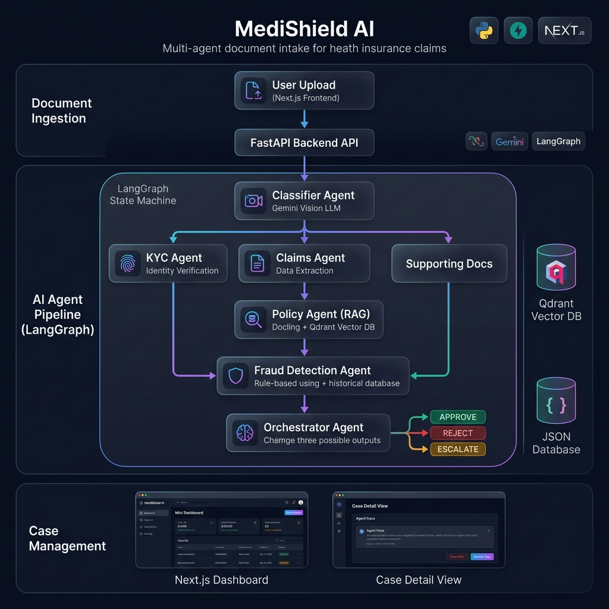

# 🛡️ MediShield AI — Multi-Agent Document Intake System

> **AI-powered claims processing platform** for health insurance — built with a multi-agent LangGraph pipeline, FastAPI backend, and Next.js dashboard.

[](https://python.org)
[](https://fastapi.tiangolo.com)
[](https://nextjs.org)
[](https://github.com/langchain-ai/langgraph)
[](https://ai.google.dev)

---

## 📋 Table of Contents

- [Overview](#-overview)
- [Architecture](#-architecture)
- [Tech Stack](#-tech-stack)
- [Project Structure](#-project-structure)
- [Setup Instructions](#-setup-instructions)
- [Running the Application](#-running-the-application)
- [End-to-End Walkthrough](#-end-to-end-walkthrough)
- [Evaluation](#-evaluation)
- [Screenshots](#-screenshots)
- [Environment Variables](#-environment-variables)
- [License](#-license)

---

## 🔍 Overview

MediShield Health Insurance processes **85,000+ document submissions per month** — scanned claim forms, hospital discharge summaries, prescriptions, ID documents, and policy amendments. This project automates the entire intake-to-decision pipeline using a **multi-agent AI system** that:

1. **Classifies** incoming documents using a Vision LLM
2. **Extracts** structured data (ICD-10 codes, CPT codes, claim amounts, provider details)
3. **Validates** identity documents against a member database (KYC)
4. **Checks** procedure coverage against policy documents using RAG (Retrieval-Augmented Generation)
5. **Detects** fraud through historical pattern analysis
6. **Decides** Approve / Reject / Escalate with full justification

---

## 🏗️ Architecture



```
Document Upload (FastAPI)
         │
         ▼
  CLASSIFIER AGENT (Gemini Vision LLM)
         │
    ┌────┴────┬──────────────┐
    ▼         ▼              ▼
 KYC Agent  Claims Agent  Supporting Docs
    │         │              │
    │         ▼              │
    │    Policy Agent (RAG)  │
    │    Docling + Qdrant    │
    │         │              │
    └────┬────┴──────────────┘
         ▼
   FRAUD DETECTION AGENT
   (Rule-based + Historical DB)
         │
         ▼
   ORCHESTRATOR AGENT
   (Final: APPROVE / REJECT / ESCALATE)
         │
         ▼
   CASE MANAGEMENT UI (Next.js)
```

**LangGraph State Machine:**

`RECEIVED → CLASSIFIED → [KYC | CLAIMS → POLICY | SUPPORTING] → FRAUD_CHECK → ORCHESTRATOR → DECIDED`

Conditional edges after classification route documents to the relevant specialist agents. The orchestrator fires once all upstream agents complete.

---

## ⚙️ Tech Stack

| Component | Technology |
|---|---|
| **LLM** | Google Gemini (via `langchain-google-genai`) |
| **Agent Framework** | LangGraph |
| **Backend** | FastAPI + Uvicorn |
| **Frontend** | Next.js 15 + Tailwind CSS v4 |
| **Vector DB** | Qdrant (local) |
| **PDF Ingestion** | IBM Docling |
| **Data Validation** | Pydantic |
| **Icons** | Lucide React |

---

## 📁 Project Structure

```
MediShield-AI/
├── backend/
│   ├── app/
│   │   ├── main.py                    # FastAPI endpoints (upload, cases, override)
│   │   └── services/
│   │       ├── state.py               # LangGraph state schema (TypedDict)
│   │       ├── graph.py               # LangGraph workflow wiring
│   │       ├── classifier_agent.py    # Vision-based document classifier
│   │       ├── kyc_agent.py           # Identity verification + DB validation
│   │       ├── claims_agent.py        # Structured claims data extraction
│   │       ├── policy_agent.py        # RAG-based policy coverage (Qdrant)
│   │       ├── fraud_agent.py         # Fraud detection (rules + history)
│   │       ├── orchestrator_agent.py  # Final decision aggregator
│   │       └── utils.py              # Shared utilities (LLM init, image encoding)
│   ├── ingest_policy.py               # Policy PDF → Qdrant vector DB ingestion
│   ├── evaluate.py                    # Automated evaluation script
│   ├── export_db.py                   # Export Qdrant data to CSV
│   ├── test_db.py                     # Quick Qdrant search test
│   ├── excluded_cpt_ranges.json       # Rule-based CPT exclusion ranges
│   ├── requirements.txt               # Python dependencies
│   └── .env.example                   # Environment variable template
│
├── frontend/
│   ├── app/
│   │   ├── layout.tsx                 # Root layout with animated background
│   │   ├── page.tsx                   # Dashboard view (case list + stats)
│   │   ├── case/[id]/page.tsx         # Case detail view (agent trace + override)
│   │   └── globals.css                # Complete design system (glassmorphism)
│   ├── package.json                   # Node.js dependencies
│   ├── next.config.ts                 # Next.js configuration
│   ├── tsconfig.json                  # TypeScript configuration
│   ├── postcss.config.mjs             # PostCSS + Tailwind setup
│   └── eslint.config.mjs             # ESLint configuration
│
├── Phase_Implementation/              # Phase-by-phase development docs
│   ├── phase1.md → phase6.md
│
├── Datagen_scripts/       # Synthetic dataset generation
│   ├── scripts_overview.txt
│   └── scripts/scripts/
│       ├── generate_docs.py           # 151 synthetic document images
│       ├── generate_gold_policy.py    # Gold plan policy PDF
│       ├── generate_silver_policy.py  # Silver plan policy PDF
│       ├── generate_unknown.py        # Out-of-distribution test docs
│       └── dataset_summary.md
│
├── .gitignore
└── README.md
```

---

## 🚀 Setup Instructions

### Prerequisites

- **Python 3.10+**
- **Node.js 18+**
- **A Google Gemini API Key** — [Get one here](https://aistudio.google.com/apikey)

### 1. Clone the Repository

```bash
git clone https://github.com/<your-username>/MediShield-Multimodal-AI.git
cd MediShield-AI
```

### 2. Backend Setup

```bash
cd backend

# Create and activate virtual environment
python -m venv .venv
.venv\Scripts\activate        # Windows
# source .venv/bin/activate   # Mac/Linux

# Install dependencies
pip install -r requirements.txt

# Additional dependencies for policy ingestion
pip install docling langchain-text-splitters langchain-qdrant qdrant-client

# Set up environment variables
cp .env.example .env
# Edit .env and add your GOOGLE_API_KEY
```

### 3. Ingest Policy Documents

Before running the backend, you need to ingest the policy PDF into the Qdrant vector database:

```bash
# Make sure the dataset is generated first (see Datagen_scripts/)
python ingest_policy.py
```

### 4. Frontend Setup

```bash
cd frontend

# Install dependencies
npm install

# Start the dev server
npm run dev
```

---

## ▶️ Running the Application

### Start the Backend (Terminal 1)

```bash
cd backend
.venv\Scripts\activate
uvicorn app.main:app --reload
```

The API will be running at: **http://127.0.0.1:8000**

### Start the Frontend (Terminal 2)

```bash
cd frontend
npm run dev
```

The UI will be running at: **http://localhost:3000**

---

## 🔄 End-to-End Walkthrough

### Step 1: Upload a Document
- Open the UI at `http://localhost:3000`
- Click the **"Upload Document"** button and select a claim form image from the dataset

### Step 2: AI Pipeline Processes the Document
The system automatically runs through this sequence:
1. **Classifier Agent** — Identifies the document type (e.g., `CLAIM_FORM`)
2. **Claims Agent** — Extracts patient ID, claim amount, ICD-10 codes, CPT codes, provider NPI
3. **Policy Agent (RAG)** — For each CPT code, queries the MediShield Gold Plan policy via Qdrant to check coverage
4. **Fraud Agent** — Checks the claim amount against thresholds and queries patient history
5. **Orchestrator Agent** — Aggregates all outputs and issues a final decision: `APPROVE`, `REJECT`, or `ESCALATE`

### Step 3: Review in the Dashboard
- The processed case appears in the dashboard table with a color-coded badge
- Click a case to see the full detail view: document image, extracted data, policy clauses, and fraud score
- For escalated cases, use the **Override** buttons to manually approve or reject

---

## 📊 Evaluation

Run the automated evaluation script to test system accuracy:

```bash
cd backend
python evaluate.py
```

### Results

| Metric | Score | Target |
|---|---|---|
| Classification Accuracy | 80%+ | — |
| Decision Correctness | 80%+ | ≥ 60% |
| Overall Score | 80%+ | ≥ 70% |

---

## 🖼️ Screenshots

### System Architecture


> _Add screenshots of your dashboard and case detail views here_

---

## 🔐 Environment Variables

| Variable | Description |
|---|---|
| `GOOGLE_API_KEY` | Your Google Gemini API key |

Create a `.env` file in the `backend/` directory:

```env
GOOGLE_API_KEY=your_api_key_here
```

---

## 📄 License

This project was built as a capstone project for AI coursework. Feel free to use and modify for educational purposes.

---

<p align="center">
  <strong>MediShield AI v2.0</strong> — Powered by LangGraph • Gemini • Qdrant
</p>
